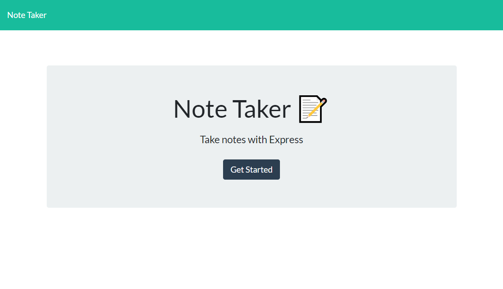
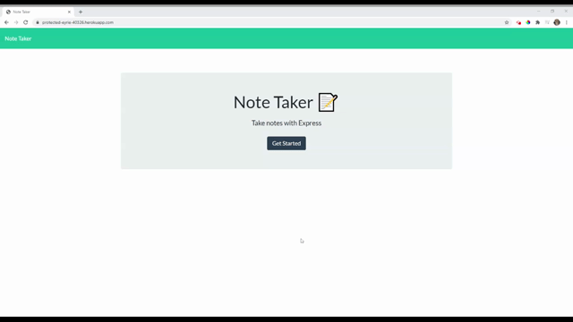

# Note Taker

Keep track of your thoughts, errands, and outstanding tasks using this quick and easy Note Taker app!

## Table of Contents

1. [Usage](#Usage)
1. [Languages and Concepts](#Languages-and-Concepts)
1. [Demo](#Demo)
1. [Method](#Method)
1. [Roadmap](#Roadmap)
1. [Links](#Links)
1. [Contact](#Contact)
1. [Contributing](#Contributing)
1. [License](#License)
1. [Test](#Test)

## Usage

Are you having a hard time keeping track of everything you have going on? Try this note taking app! It's easy to add a note with a title and text to be saved for later reference and when you don't need it anymore, it's easy to delete with the click of a button! Take that to-do list!

## Languages and Concepts

- JavaScript
- [jQuery](https://jquery.com/)
- [Node.js](https://nodejs.org/en/)
- [Express.js](https://expressjs.com/)
- [Uniqid](https://www.npmjs.com/package/uniqid)
- [Bootstrap](https://getbootstrap.com/)
- [Font Awesome](https://fontawesome.com/)

## Demo

## Method

For this project, my aim was to create an express server and the back-end API calls. To begin, I initialized my files, creating a server.js file and ran 

    npm i 
to install the express dependencies.

Once I was set up, my first step was to establish the server, specifying a PORT and an app.listen function and ran 

    node server.js 

to verify the server was running.

Once the server was set up, I added html routes using app.get to display the html pages. I prompted the server and tested to make sure both of the html pages were displaying properly. Initially the notes.html page was not displaying the CSS properly, however after adding middleware to handle the public folder, the error cleared and was now displaying how it should.

My next step, now that the html was displaying, was to get the existing notes to display in the lefthand column. I created an API route, app.get, to display all existing notes from the db.json file, ran the server and tested to verify they were displaying.

The next steps I needed to accomplish were to set up API routes for saving a new note, viewing an existing note and deleting an existing note. But first I decided to clean up the server.js page and move the routing code into a routes folder and into their own files: apiRoutes.js and htmlRoutes.js. After doing this, I ran the code to verify it was still working. 

Now to save a new note, I added an app.post function, including adding the new note to the existing db.json file. 

Next I wanted to add an app.get to display a single note when clicked on, but first I needed to add an id to each of the notes. I first added an id to each of the notes to get my code working. Now that the notes were set with ids, I added the app.get to display a single note and verified that it worked, both to view a single note and to add a new note when the user clicks the pen icon.

The last feature to add was the delete function, where the user can click on the trash can to delete that specific note. Using the ids, I created a for loop to loop through the database and compare the id of that note to the ids on each of the notes. At first I was getting an error, but I figured out I was comparing a string to an integer, so once a parseInt() was added, it was working. Now that my for loop was functioning correctly, I added .splice() to delete the note from the database once a match was found and an fs.writeFile() to rewrite the database with the updated information and display on the web page.

Now that my web page was functioning, I wanted to find a way to add an id to each new note when it is added. At first I thought I could create a .forEach() function to add an id, but upon reflection, I realized, this function would need to be repeated each time a note was added or deleted. After doing some research, I found a node package called [uniqid()](https://www.npmjs.com/package/uniqid), which adds a unique id in the form of a hexatridecimal id, based on the current time, process and machine name. I installed this node package, and adjusted my code for when a new note is created, so it will add the title, text and the id for that note. And to finish the delete note function, it will now be comparing a string, so I removed the parseInt() and tested. Everything is working!

## Roadmap

To further this project, I would like users to be able to edit an existing note and a clear all notes function. I would like the notes to have the date they were written notated on the side and for the user to be able to categorize their notes: perhaps some pertain to home, work, school, shopping, note to self etc. Then with these features, I could add filters so the user could see by date or date range or by category. I would like to also add a sign in for users, so they can keep their tasks secure.

## Links

- [Project Repository](https://github.com/ncmarsh/note_taker)
- [Access the live page](https://protected-eyrie-40326.herokuapp.com/)

## Contact

- Nicole Marshall - [@ncmarsh](https://github.com/ncmarsh)

## Contributing

This is a personal project; no contributions are required at this time.

## License

No license granted.

##### [Return to Top of Page](#Note-Taker)